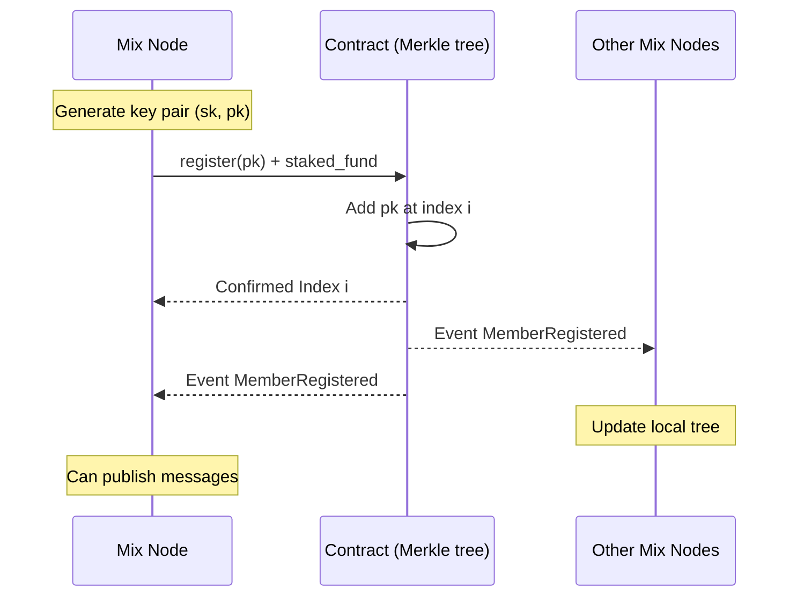

## Abstract

This document specifies the integration of Rate Limiting Nullifiers (RLN) to provide spam and sybil protection for mixnets, which are based on the [libp2p mix](https://github.com/vacp2p/rfc-index/blob/ad26780dfc2681c300209820f356cc33ce249d94/vac/raw/mix.md) protocol.

An example is an instantiation of [Waku-mix](https://github.com/logos-messaging/specs/blob/c5fe03e5166e5f8032c445d02a23d57a88a5fe81/standards/core/mix.md) where a new mix path is randomly selected for each published message.
The RLN mechanism enables cryptographic rate limiting while preserving privacy, allowing mix nodes to detect and reject spam without identifying legitimate users.

## Background / Rationale / Motivation

Mixnets provide strong privacy guarantees by routing messages through multiple intermediate nodes (mix nodes) that re-encrypt and delay traffic to prevent correlation attacks. However, the [libp2p mix](https://github.com/vacp2p/rfc-index/blob/dabc31786b4a4ca704ebcd1105239faff7ac2b47/vac/raw/mix.md) protocol specification identifies two critical vulnerabilities that must be addressed for production deployments:

1. **Spam attacks**: Abusive or unsolicited traffic targeting mix nodes, which can exhaust computational, memory, or bandwidth resources
2. **Sybil attacks**: Adversaries operating multiple node identities to increase the probability of path compromise, enabling deanonymization through traffic correlation or timing analysis

To make a libp2p mix based mixnet production-ready and resilient to attacks mentioned above, spam protection and sybil resistance mechanisms MUST be implemented.

The [libp2p mix](https://github.com/vacp2p/rfc-index/blob/ad26780dfc2681c300209820f356cc33ce249d94/vac/raw/mix.md) protocol provides an extension for integrating spam protection mechanisms.
This specification adopts [RLN](https://github.com/vacp2p/rfc-index/blob/dabc31786b4a4ca704ebcd1105239faff7ac2b47/vac/raw/rln-v2.md) (Rate Limiting Nullifiers) as the spam prevention and sybil protection mechanism for the following reasons:

- Requires stake registration, making spam attacks costly and limiting sybil node creation
- Uses zero-knowledge proofs to enforce rate limits without revealing user identities
- Can operate in resource-constrained environments, suitable for diverse network participants
- Enables on-chain slashing for provable violations, creating strong economic deterrence

## Terminology

The key words “MUST”, “MUST NOT”, “REQUIRED”, “SHALL”, “SHALL NOT”, “SHOULD”, “SHOULD NOT”, “RECOMMENDED”,
“NOT RECOMMENDED”, “MAY”, and “OPTIONAL” in this document are to be interpreted as described in [RFC 2119](https://www.ietf.org/rfc/rfc2119.txt).

### Node Roles

The following types of nodes are possible in the mixnet.

- Edge nodes (Entry role) - Nodes that only send messages in the mixnet. These nodes do not forward any messages generated by other nodes.
- Core nodes - (Intermediate and/or exit role) - Nodes that can send messages or forward messages received via mix. These nodes also send replies via SURB.

### Messaging Rate

The messaging rate is defined by the `period` which indicates how many messages can be sent/forwarded in a given period.
We define an `epoch` as $\lceil$ `unix_time` / `period` $\rceil$.
For example, if `unix_time` is `1644810116` and we set `period` to `30`, then `epoch` is $\lceil$ `(unix_time/period)` $\rceil$ `= 54827003`.

> **NOTE:** The `epoch` refers to the epoch in RLN and not Unix epoch.
> This means a message can only be sent every period, where the `period` is up to the application.

See section [Recommended System Parameters](#recommended-system-parameters) for the RECOMMENDED method to set a sensible `period` value depending on the application.

## Approach

### Overview

The proposed way to integrate RLN into libp2p mix based mixnets is using the [per-hop generated proof approach](https://github.com/vacp2p/rfc-index/blob/ad26780dfc2681c300209820f356cc33ce249d94/vac/raw/mix.md#922-per-hop-generated-proofs).
Each mix node operating as an entry node, intermediate node or an exit MUST have an RLN membership in order to send/process mix traffic.

RLN enforces cryptographic rate limits on each node's message throughput.
Nodes that exceed their allowed rate can be cryptographically detected and slashed.
By requiring stake-backed membership for each mix node, RLN makes it economically costly to operate multiple identities, mitigating sybil attacks that could compromise mix path selection.

Intermediate nodes may experience a multiplier effect, many entry nodes may select the same intermediate node simultaneously within an epoch, resulting in higher aggregate traffic.
Therefore, intermediate nodes require higher rate limits than entry nodes to avoid rejecting legitimate traffic.
RLN-Diff as explained in RLNv2 can be used to achieve the same.

Mix nodes (intermediate and exit) MUST track nullifiers used within each epoch.
This prevents nodes from reusing nullifiers to exceed their rate limit.

The global membership state SHOULD be synchronized across all mix nodes to ensure they use the latest Merkle root when generating or verifying RLN proofs.
Stale roots may cause legitimate proofs to be rejected.
However, to accommodate network delays and registration latency, nodes SHOULD maintain a window of recent valid roots (see `acceptable_root_window_size` in [Recommended System Parameters](#recommended-system-parameters)).

### Setup and registration

A mixnet that is spam-protected requires all mix nodes in it to form a [RLN group](../../../../vac/32/rln-v1.md).

- Mix nodes MUST be registered to the RLN group to be able to publish or forward messages.
- Registration MAY be moderated through a smart contract deployed on a blockchain.

Each mix node has an [RLN key pair](../../../../vac/32/rln-v1.md) denoted by `sk`
and `pk`.

- The secret key `sk` is secret data and MUST be persisted securely by the mix node.
- The state of the membership contract SHOULD contain a list of all registered members' public identity keys i.e., `pk`s.

For registration, a mix node MUST create a transaction to invoke the registration function on the contract, which registers its `pk` in the RLN group.

- The transaction MUST transfer additional tokens to the contract to be staked.
  This amount is denoted by `staked_fund` and is a system parameter.
  The mix node who has the secret key `sk` associated with a registered `pk` would be able to withdraw a portion `reward_portion` of the staked fund by providing valid proof.

`reward_portion` is also a system parameter.

> **NOTE:** Initially `sk` is only known to its owning mix node however,
> it may get exposed to other mix nodes in case the owner attempts spamming the system
> i.e., sending more than rate limit per `epoch`.

An overview of registration is illustrated in Figure 1.



### Sending messages

### Group Synchronization and tree maintenance

Proof generation relies on the knowledge of Merkle tree root `merkle_root` and `authPath` which both require access to the membership Merkle tree.
Getting access to the Merkle tree can be done in various ways:

1. Mix nodes construct the tree locally.
   This can be done by listening to the registration and deletion events emitted by the membership contract.
   Mix nodes MUST update the local Merkle tree on a per-block basis.
   This is discussed further in the [Merkle Root Validation](#merkle-root-validation) section.

2. For synchronizing the state of slashed `pk`s, disseminate such information through a logos-messaging `contentTopic` to which all mix nodes are subscribed.
   A deletion transaction SHOULD occur on the membership contract.
   The benefit of an off-chain slashing is that it allows real-time removal of spammers as opposed to on-chain slashing in which mix nodes get informed with a delay, where the delay is due to mining the slashing transaction.

For the group synchronization, one important security consideration is that peers MUST make sure they always use the most recent Merkle tree root in their proof generation.
The reason is that using an old root can allow inference about the index of the user's `pk` in the membership tree hence compromising user privacy and breaking message unlinkability.

### Forwarding

#### Spent Nullifier Synchronization

#### Epoch validation

#### Merkel root validation

#### Spam detection

#### Slashing??

how to deal with scenario where an intermediate node received too many messages in the epoch which has already crossed its rate limit to forward?

### Payload format to be added to Sphinx packet

```

syntax = "proto3";

message RateLimitProof {
bytes proof = 1;
bytes merkle_root = 2;
bytes epoch = 3;
bytes share_x = 4;
bytes share_y = 5;
bytes nullifier = 6;
}

```

#### RateLimitProof

Below is the description of the fields of `RateLimitProof` and their types.

|               Parameter | Type                                     | Description                                                                                                                                                                                                                                                                                                                           |
| ----------------------: | ---------------------------------------- | ------------------------------------------------------------------------------------------------------------------------------------------------------------------------------------------------------------------------------------------------------------------------------------------------------------------------------------- |
|                 `proof` | array of 128 bytes compressed            | the zkSNARK proof as explained in the [Sending process](#sending)                                                                                                                                                                                                                                                                     |
|           `merkle_root` | array of 32 bytes in little-endian order | the root of membership group Merkle tree at the time of publishing the message                                                                                                                                                                                                                                                        |
| `share_x` and `share_y` | array of 32 bytes each                   | Shamir secret shares of the user's secret identity key `sk` . `share_x` is the Poseidon hash of the `WakuMessage`'s `payload` concatenated with its `contentTopic` . `share_y` is calculated using [Shamir secret sharing scheme](https://github.com/vacp2p/rfc-index/blob/dabc31786b4a4ca704ebcd1105239faff7ac2b47/vac/32/rln-v1.md) |
|             `nullifier` | array of 32 bytes                        | internal nullifier derived from `epoch` and peer's `sk` as explained in [RLN construct](https://github.com/vacp2p/rfc-index/blob/dabc31786b4a4ca704ebcd1105239faff7ac2b47/vac/32/rln-v1.md)                                                                                                                                           |

### Flow diagrams

### Recommended System Parameters (Review)

The system parameters are summarized in the following table,
and the RECOMMENDED values for a subset of them are presented next.

|                     Parameter | Description                                                                            |
| ----------------------------: | -------------------------------------------------------------------------------------- |
|                      `period` | the length of `epoch` in seconds                                                       |
|                 `staked_fund` | the amount of funds to be staked by peers at the registration                          |
|              `reward_portion` | the percentage of `staked_fund` to be rewarded to the slashers                         |
|               `max_epoch_gap` | the maximum allowed gap between the `epoch` of a routing peer and the incoming message |
| `acceptable_root_window_size` | The maximum number of past Merkle roots to store                                       |

#### Epoch Length

A sensible value for the `period` depends on the application for which the spam protection is going to be used.
For example, while the `period` of `1` second i.e., messaging rate of `1` per second, might be acceptable for a chat application, might be too low for communication among Ethereum network validators.
One should look at the desired throughput of the application to decide on a proper `period` value.

#### Maximum Epoch Gap

We discussed in the [Forwarding](#forwarding) section that the gap between the epoch observed by the mix node and the one attached to the incoming message should not exceed a threshold denoted by `max_epoch_gap`.
The value of `max_epoch_gap` can be measured based on the following factors.

- Network delay `Network_Delay`: the maximum time that it takes for a message to reach the next node.
- Clock asynchrony `Clock_Asynchrony`: The maximum difference between the Unix epoch clocks perceived by mix nodes which can be due to clock drifts.

With a reasonable approximation of the preceding values, one can set `max_epoch_gap` as

`max_epoch_gap`
$= \lceil \frac{\text{Network Delay} + \text{Clock Asynchrony}}{\text{Epoch Length}}\rceil$ where `period` is the length of the `epoch` in seconds. `Network_Delay` and `Clock_Asynchrony` MUST have the same resolution as `period`.
By this formulation, `max_epoch_gap` indeed measures the maximum number of `epoch`s that can elapse since a message gets routed from its origin to all the other peers in the network.

`acceptable_root_window_size` depends upon the underlying chain's average blocktime, `block_time`

The lower bound for the `acceptable_root_window_size` SHOULD be set as $acceptable_root_window_size=(Network_Delay)/block_time$

`Network_Delay` MUST have the same resolution as `block_time`.

By this formulation, `acceptable_root_window_size` will provide a lower bound of how many roots can be acceptable by a mix node.

The `acceptable_root_window_size` should indicate how many blocks may have been mined during the time it takes for a mix node to receive a message.
This formula represents a lower bound of the number of acceptable roots.

## Wire Format Specification / Syntax

This section SHOULD not contain explanations of semantics and focus on concisely defining the wire format.
Implementations SHOULD adhere to these exact formats to interoperate with other implementations.
It is fine, if parts of the previous section that touch on the wire format are repeated.
The purpose of this section is having a concise definition of what an implementation sends and accepts.
Parts that are not specified here are considered implementation details.
Implementors are free to decide on how to implement these details.

## Implementation Suggestions

- Interface for RLN to align with mix suggested plugin

## (Further Optional Sections)

## Security/Privacy Considerations

- Mention that mixnode/RLN membership distribution is out of scope of this rfc
- Analyze and list down security assumptions or any limitations that can be exploited

## Limitations

### Additional Latency due to proof generation in every hop

TBD

### Membership registration friction

TBD

## Future Work

In order to reduce latency introduced at each hop, RLN can be used with pre-computed proofs as explained [here](https://forum.vac.dev/t/rln-with-pre-computed-proofs/606). This approach can be explored further and then can replace current proposed RLN.

Augment RLN with additional sybil resistance mechanisms with some sort of reputation based lists something similar to what Tor’s “directory authorities”.
They help clients build circuits that are probably not entirely controlled by Sybils through a range of techniques that limits nodes’ possible influence based on some metrics that could indicate trustworthiness

- Do we need to augement with some local reputation?

## Copyright

Copyright and related rights waived via [CC0](https://creativecommons.org/publicdomain/zero/1.0/).

## References

libp2p mix protocol - https://github.com/vacp2p/rfc-index/blob/dabc31786b4a4ca704ebcd1105239faff7ac2b47/vac/raw/mix.md
waku mix - https://github.com/logos-messaging/specs/blob/c5fe03e5166e5f8032c445d02a23d57a88a5fe81/standards/core/mix.md
Rate Limiting Nullifiers - https://github.com/vacp2p/rfc-index/blob/dabc31786b4a4ca704ebcd1105239faff7ac2b47/vac/raw/rln-v2.md
RLN with precomputed proofs - https://forum.vac.dev/t/rln-with-pre-computed-proofs/606
