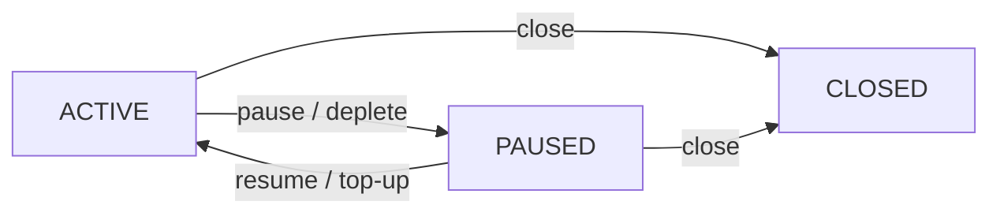

## Abstract

This document provides a functional specification
for a payment streams protocol for Logos services.

A payment stream is an off-chain protocol
where a payer's deposit releases gradually to a payee.
The blockchain determines fund accrual based on elapsed time.

The protocol targets Nescience,
a privacy-focused blockchain in the Logos stack.
This document clarifies MVP requirements
and facilitates discussion with Nescience developers
on implementation feasibility and challenges.

## Language

The key words "MUST", "MUST NOT", "REQUIRED", "SHALL", "SHALL NOT",
"SHOULD", "SHOULD NOT", "RECOMMENDED", "MAY", and "OPTIONAL"
in this document are to be interpreted as described in
[RFC 2119](http://tools.ietf.org/html/rfc2119).

## Change Process

This document is governed by the [1/COSS](../1/coss.md) (COSS).

## Motivation

Logos is a privacy-focused tech stack that includes
Logos Messaging, Logos Blockchain, and Logos Storage.

Logos Messaging comprises a suite of communication protocols
with both P2P and request-response structures.
The backbone P2P protocols use tit-for-tat mechanisms.
We plan to introduce incentivization
for auxiliary request-response protocols
where client and server roles are well defined.
One such protocol is Store,
which allows clients to query historical messages
from Logos Messaging relay nodes.

We target the following requirements:

- Performance: Efficient payments with low latency and fees.
- Security: Limited loss exposure through spending controls.
- Privacy: Unlinkable payments across different providers.
- Extendability: Simple initial design with room for enhancements.

After reviewing prior work on payment channels, streams,
e-cash, and tickets,
we selected payment streams as the most suitable mechanism.

Payment streams enable unidirectional time-based fund flows
from payer to payee.
Streams are simpler than alternatives
and map well to use cases with distinct roles.
Parties need not store old states or initiate disputes
as required in payment channel protocols.
Streams avoid relying on a centralized mint entity,
typical for e-cash and ticket protocols,
improving resilience and privacy.

Nescience is a privacy-focused blockchain under development
for the Logos Blockchain stack.
Its core innovation is state separation architecture (NSSA),
which enables both transparent and shielded execution.
Nescience is a natural fit
for the on-chain component of the payment protocol.

This document provides clarity on MVP requirements
and facilitates discussion with Nescience developers on:
whether the required functionality can be implemented,
which parts are most challenging and how to simplify them,
and other implementation considerations.

## Theory and Semantics

### Architecture Overview

The protocol has two roles:

- User: the party paying for services (payer).
- Provider: the party delivering services
and receiving payment (payee).

The protocol uses a two-level architecture
of vaults and streams.

A vault holds a user's deposit and backs multiple streams.
A user MAY have multiple vaults.
To start using the protocol,
the user MUST deposit funds into a vault.
A vault holds the total balance available for that vault's streams.
One vault MAY have multiple streams to different providers.
The user MAY withdraw unallocated funds from the vault at any time.
Vault withdrawals send funds to addresses,
which MAY be external addresses or other vaults.
Allocating funds from a vault to a stream
is not considered a withdrawal,
as the funds remain within the protocol.

A stream is an individual payment flow from a vault to one provider.
When creating a stream,
the user MUST allocate a portion of vault funds to that stream.
Each stream MUST belong to exactly one vault.
Each stream MUST specify an accrual rate (tokens per time unit).
An allocation is the portion of vault funds committed to a stream.
The sum of all stream allocations MUST NOT exceed vault balance.

A claim is the operation
where the provider retrieves accrued funds from a stream.
The provider MAY claim accrued funds from a stream in any state.

### Stream Lifecycle

Stream states:

- ACTIVE: Funds accrue to the provider at the agreed rate.
- PAUSED: Accrual is stopped.
The stream transitions to PAUSED by user action
or automatically when allocated funds are fully accrued.
The stream MAY be resumed by the user.
- CLOSED: Stream is permanently terminated.
The stream MUST NOT transition to any other state.

Stream state transitions:

- Create: User creates a stream in ACTIVE state
by allocating funds from the vault.
- Pause: User pauses an ACTIVE stream, stopping accrual.
The stream also transitions automatically from ACTIVE to PAUSED
when allocated funds are fully accrued.
- Resume: User resumes a PAUSED stream, restarting accrual.
Resume MUST fail if remaining allocation is zero.
- Top-Up: User MAY add funds to stream allocation.
Top-up MUST transition the stream to ACTIVE state.
If the user wants to add funds without resuming,
the user MUST pause the stream after top-up.
- Close: Either user or provider MAY close the stream
from any non-CLOSED state.
- Withdraw: User MAY withdraw only unaccrued funds
from a CLOSED stream.
A withdraw operation MUST return funds to the vault.
The user MUST NOT withdraw from any non-CLOSED stream.
When a stream is closed,
unaccrued funds MUST automatically return to the user's vault.
Accrued funds remain available for provider to claim.
- Claim: Provider MAY claim accrued funds
from a stream in any state.
A claim operation does not change stream state.

### Stream State Transition Diagram

### Assumptions

Parties MUST agree on stream parameters before creation.
A separate discovery protocol SHOULD enable
providers to advertise services and expected payment,
or enable users and providers to negotiate parameters.

Users SHOULD monitor service delivery
and take action when providers stop delivering service.
Since users are typically online to receive service,
monitoring quality and pausing or closing streams
is a reasonable expectation.

Providers SHOULD monitor the stream on-chain
and SHOULD stop providing service when a stream
is not ACTIVE.

## Off-Chain Protocol

This section describes off-chain communication
for stream establishment, service delivery, and closure.

### Design Rationale

On-chain state is the source of truth for fund allocation and accrual.
Off-chain communication coordinates lifecycle events
and enables service delivery.

Users MAY pause or close streams without prior notice.
Providers SHOULD track on-chain state for their streams.

If the provider stops serving the user,
the provider MUST notify the user off-chain
before closing the stream on-chain.

### Message Types

#### Stream Establishment

StreamRequest:
The user sends a StreamRequest to initiate a stream.
This message MUST include:

- service_type: identifier of the requested service
- stream_rate: proposed accrual rate (tokens per time unit)
- stream_allocation: proposed initial allocation
- public_key: key for signing subsequent service requests

StreamResponse:
The provider responds with acceptance or rejection.
This message MUST include:

- status: ACCEPTED or REJECTED
- reason: explanation if rejected (OPTIONAL)

If accepted, the user creates the stream on-chain.
Acceptance commits the provider to deliver the specified service
while payment accrues at the agreed rate.
The provider MAY later terminate service
but MUST send a ServiceTermination message first.

#### Service Request

ServiceRequest:
The user sends service requests during stream operation.
Each request MUST include:

- request_data: service-specific payload
- signature: signature over request_data using the committed public key

The signature proves the request originates from the stream owner.
The provider tracks on-chain state to verify the stream remains active.

This design assumes the underlying blockchain provides funding privacy.
Stream creation MUST NOT reveal which vault funded the stream.
Vault deposits MUST NOT reveal the depositor's identity.

#### Service Termination

ServiceTermination:
The provider sends this message when stopping service.
This message MUST include:

- termination_type: TEMPORARY or PERMANENT
- resume_after: timestamp after which service MAY resume
  (REQUIRED for TEMPORARY, empty for PERMANENT)

For temporary termination,
the user MAY pause the stream until the resume_after time.
For permanent termination,
the user SHOULD close the stream to recover unaccrued funds.

## Protocol Extensions

This section describes optional modifications
that MAY be applied to the base protocol.
Each extension is independent.

### Auto-Pause

The user MAY specify an auto-pause duration when creating a stream.
When the specified duration elapses since stream creation or last resume,
the stream MUST automatically transition to PAUSED state.
The user MAY resume the stream, resetting the auto-pause timer.

Auto-pause limits loss if service stops and the user is offline.
Per-stream allocation already bounds total risk;
auto-pause adds periodic check-ins for long-running streams.

### Delivery Receipts

The claim operation MAY require delivery receipts as proof of service.
A delivery receipt is a user-signed message that MUST include
stream identifier, service delivery details, and signature.
If a stream has delivery receipts enabled,
the protocol MUST only allow claims with valid receipts.

Receipt granularity presents a trade-off.
Per-message receipts allow the user to approve each message individually
but require signing each receipt, increasing interaction overhead.
Batched receipts reduce signing overhead
but require the user to approve multiple messages at once.

### Automatic Claim on Closure

This extension adds an optional auto-claim flag.
When auto-claim is enabled,
closing the stream MUST automatically claim accrued funds for the provider.

Auto-claim simplifies the protocol
by ensuring closed streams hold no funds,
eliminating the need to track balances in closed streams.

However, auto-claim has potential issues:
prevents provider from batching claims,
may create timing correlations that leak privacy,
requires user to pay for provider's claim operation,
and may cause the entire close operation to fail if claim fails.

Assessing these trade-offs requires clarity on Nescience architecture,
particularly gas model, batching techniques, and timing privacy.

### Activation Fee

A user MAY exploit the pause/resume mechanism
by keeping a stream paused and resuming only briefly to query a service.
This results in minimal payment for actual service usage.

The activation fee extension addresses this attack.
When enabled, the stream MUST accrue a fixed activation fee
immediately upon entering ACTIVE state.
The fee applies to stream creation, resume, and top-up operations.
Note that only user actions transition a stream to ACTIVE state.

The activation fee SHOULD reflect
the minimum acceptable payment for a service session.
If the fee exceeds the value of a single query,
the attack becomes economically unviable.

Providers MAY alternatively address this attack via off-chain policy
by refusing service to users who pause and resume excessively.

## Implementation Considerations

This section captures implementation questions:

- Mapping streams to NSSA:
How does the stream protocol map onto Nescience architecture?
- Timestamp-based accrual calculation:
Can shielded execution access block timestamps
to calculate accrued amounts based on elapsed time?
- Encoding and enforcing state transitions:
How to encode and enforce state machine transition rules
for the stream lifecycle states?

## Security and Privacy Considerations

This section captures security and privacy questions:

- Can or should all protocol operations be within shielded execution?
- If not, where is the boundary
between transparent and shielded execution?
- Who decides whether to use transparent or shielded execution:
user, provider, both, or fixed by protocol design?
- What data is stored in the user's account
and who can see it in transparent vs shielded execution?
- How to ensure external observers cannot correlate
streams from the same vault across different providers?
- How to ensure providers cannot see
streams from the same user to other providers,
while still being able to verify balance constraints?

## Copyright

Copyright and related rights waived via [CC0](https://creativecommons.org/publicdomain/zero/1.0/).

## References

### Informative

#### Related Work

- [Off-Chain Payment Protocols: Classification and Architectural Choice](https://forum.vac.dev/t/off-chain-payment-protocols-classification-and-architectural-choice/596)
- [Nescience: A User-Centric State-Separation Architecture](https://vac.dev/rlog/Nescience-state-separation-architecture)

#### Payment Streaming Protocols

Existing payment streaming protocols
(Sablier Flow, Sablier Lockup, LlamaPay V2, Superfluid)
target EVM-like state architectures.
They use time-based accrual with ERC-20 tokens.
Protocols differ in stream duration.
Some support fixed-duration streams (Sablier Lockup),
while others allow open-ended streams (Sablier Flow).
Deposit architecture also varies.
Singleton managers (Sablier Flow, Sablier Lockup)
require separate deposits per stream.
Per-payer vaults (LlamaPay V2)
allow one deposit to back multiple streams.

- [Sablier Flow](https://github.com/sablier-labs/flow)
- [Sablier Lockup](https://github.com/sablier-labs/lockup)
- [LlamaPay V2](https://github.com/LlamaPay/llamapay-v2)
- [Superfluid Protocol](https://github.com/superfluid-org/protocol-monorepo)
