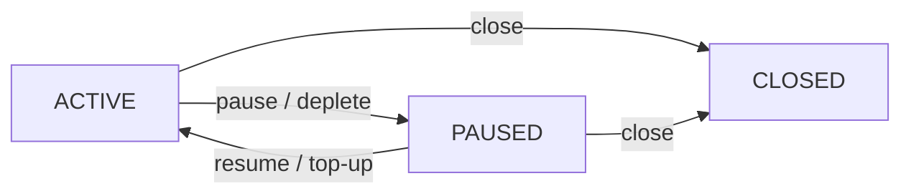

## Abstract

This document provides a functional specification
for a payment streams protocol for Logos services.

A payment stream is an off-chain protocol
where a payer's deposit releases gradually to a payee.
The blockchain determines fund accrual based on elapsed time.

The protocol targets Logos blockchain,
which includes the Logos Execution Zone (LEZ).
This document clarifies MVP requirements
and facilitates discussion with Logos blockchain and LEZ developers
on implementation feasibility and challenges.

## Language

The key words "MUST", "MUST NOT", "REQUIRED", "SHALL", "SHALL NOT",
"SHOULD", "SHOULD NOT", "RECOMMENDED", "MAY", and "OPTIONAL"
in this document are to be interpreted as described in
[RFC 2119](http://tools.ietf.org/html/rfc2119).

## Change Process

This document is governed by the [1/COSS](../1/coss.md) (COSS).

## Motivation

Logos is a privacy-focused tech stack that includes
Logos Messaging, Logos Blockchain, and Logos Storage.

Logos Messaging comprises a suite of communication protocols
with both P2P and request-response structures.
The backbone P2P protocols use tit-for-tat mechanisms.
We plan to introduce incentivization
for auxiliary request-response protocols
with well-defined user and provider roles.
One such protocol is Store,
which allows users to query historical messages
from Logos Messaging relay nodes.

We target the following requirements:

- Performance: Efficient payments with low latency and fees.
- Security: Limited loss exposure through spending controls.
- Privacy: On-chain deposit identity unlinkable to off-chain service requests.
- Extendability: Simple initial design with room for enhancements.

After reviewing prior work on payment channels, streams,
e-cash, and tickets,
we selected payment streams as the most suitable mechanism.

Payment streams enable unidirectional time-based fund flows
from payer to payee.
Streams are simpler than alternatives
and map well to use cases with distinct roles.
Parties need not store old states or initiate disputes
as required in payment channel protocols.
Streams avoid relying on a centralized mint entity,
typical for e-cash and ticket protocols,
improving resilience and privacy.

Different service patterns suit different payment mechanisms.
Ongoing services align well with streams
that provide time-based automatic fund accrual.
One-time or on-demand services suit
payment channels with one-off payments.

This specification targets streams
for services with steady usage patterns.
Addressing burst services with one-off payments
remains future work.

Logos blockchain uses the Logos Execution Zone (LEZ),
which enables both transparent and shielded execution.
LEZ is a natural fit
for the on-chain component of the payment protocol.

This document facilitates discussion with Logos developers on
whether the required functionality can be implemented,
which parts are most challenging and how to simplify them,
and other implementation considerations.

## Theory and Semantics

### Architecture Overview

The protocol has two roles:

- User: the party paying for services (payer).
- Provider: the party delivering services and receiving payment (payee).

The protocol uses a two-level architecture
of vaults and streams.

A vault holds a user's deposit and backs multiple streams.
A user MAY have multiple vaults.
One vault MAY back streams to different providers.
To start using the protocol,
the user MUST deposit funds into a vault.
The user MAY withdraw unallocated funds from the vault at any time.
Vault withdrawals send funds to addresses,
which MAY be external addresses or other vaults.
Allocating funds from a vault to a stream
is not considered a withdrawal,
as the funds remain within the protocol.

A stream is an individual payment flow from a vault to one provider.
When creating a stream,
the user MUST allocate a portion of vault funds to that stream.
Each stream MUST belong to exactly one vault.
Each stream MUST specify an accrual rate (tokens per time unit).
An allocation is the portion of vault funds committed to a stream.
The sum of all stream allocations MUST NOT exceed vault balance.

A claim is the operation
where the provider retrieves accrued funds from a stream.
The provider MAY claim accrued funds from a stream in any state.
A claim MUST transfer the full accrued balance to the provider.

### Stream Lifecycle

Stream states:

- ACTIVE: Funds accrue to the provider at the agreed rate.
- PAUSED: Accrual is stopped.
  The stream transitions to PAUSED by user action
  or automatically when allocated funds are fully accrued.
  The user MAY resume the stream.
- CLOSED: Stream is permanently terminated.
  The stream MUST NOT transition to any other state.

Stream state transitions:

- Create: User creates a stream in ACTIVE state
  by allocating funds from the vault.
- Pause: User pauses an ACTIVE stream, stopping accrual.
  The stream also transitions automatically from ACTIVE to PAUSED
  when allocated funds are fully accrued.
- Resume: User resumes a PAUSED stream, restarting accrual.
  Resume MUST fail if remaining allocation is zero.
- Top-Up: User MAY add funds to stream allocation.
  Top-up MUST transition the stream to ACTIVE state.
  If the user wants to add funds without resuming,
  the user MUST pause the stream after top-up.
- Close: Either user or provider MAY close the stream
  from any non-CLOSED state.
  When a stream is closed,
  unaccrued funds MUST automatically return to the user's vault.
  Accrued funds remain available for the provider to claim.
- Claim: Provider MAY claim accrued funds from a stream in any state.
  A claim MUST transfer the full accrued balance;
  partial claims are not supported.
  A claim operation does not change stream state.

### Stream State Transition Diagram



### Assumptions

Parties MUST agree on stream parameters before creation.
A separate discovery protocol SHOULD enable
providers to advertise services and expected payment,
or enable users and providers to negotiate parameters.

Users SHOULD monitor service delivery
and take action when providers stop delivering service.
Since users are typically online to receive service,
monitoring quality and pausing or closing streams
is a reasonable expectation.

Providers SHOULD monitor the stream on-chain
and SHOULD stop providing service when a stream is not ACTIVE.

## Off-Chain Protocol

This section describes off-chain communication
for stream establishment, service delivery, and closure.

### Design Rationale

On-chain state is the source of truth for fund allocation and accrual.
Off-chain communication coordinates lifecycle events
and enables service delivery.

Users MAY pause or close streams without prior notice.
Providers SHOULD track on-chain state for their streams.

### Message Types

#### Stream Establishment

StreamRequest:
The user sends a StreamRequest to initiate a stream.
This message MUST include:

- service_id: identifier of the requested service
- stream_rate: proposed accrual rate (tokens per time unit)
- stream_allocation: proposed initial allocation
- public_key: key for signing subsequent service requests

StreamResponse:
The provider responds with acceptance or rejection.
This message MUST include:

- status: ACCEPTED or REJECTED
- reason: explanation if rejected (OPTIONAL)
- load_cap: maximum load the provider will serve (REQUIRED if ACCEPTED)

If accepted, the user creates the stream on-chain.
Acceptance commits the provider to deliver the specified service
while payment accrues at the agreed rate.
The provider MAY terminate service prematurely
(see Service Termination).

#### Service Request

ServiceRequest:
The user sends service requests during stream operation.
Each request MUST include:

- request_data: service-specific payload
- signature: signature over request_data using the committed public key

The signature links the request to the paying stream.
The provider SHOULD verify on-chain that the stream remains active.

#### Service Termination

ServiceTermination:
The provider SHOULD send this message before stopping service.
This message MUST include:

- termination_type: TEMPORARY or PERMANENT
- resume_after: timestamp after which service MAY resume
  (REQUIRED for TEMPORARY, empty for PERMANENT)

For temporary termination,
the user MAY pause the stream until the resume_after time.
For permanent termination,
the user SHOULD close the stream to recover unaccrued funds.

## Protocol Extensions

This section describes optional modifications
that MAY be applied to the base protocol.
Each extension is independent.

### Auto-Pause

The user MAY specify an auto-pause duration when creating a stream.
When the specified duration elapses since stream creation or last resume,
the stream MUST automatically transition to PAUSED state.
The user MAY resume the stream, resetting the auto-pause timer.

Auto-pause limits loss if service stops and the user is offline.
Per-stream allocation already bounds total risk;
auto-pause adds periodic check-ins for long-running streams.

### Delivery Receipts

The claim operation MAY require delivery receipts as proof of service.
A delivery receipt is a user-signed message that MUST include
stream identifier, service delivery details, and signature.
If a stream has delivery receipts enabled,
the protocol MUST only allow claims with valid receipts.

Receipt granularity presents a trade-off.
Per-message receipts allow the user to approve each message individually
but require signing each receipt, increasing interaction overhead.
Batched receipts reduce signing overhead
but require the user to approve multiple messages at once.

### Automatic Claim on Closure

This extension adds an optional auto-claim flag.
When auto-claim is enabled,
closing the stream MUST automatically claim accrued funds for the provider.

Auto-claim simplifies the protocol
by ensuring closed streams hold no funds,
eliminating the need to track balances in closed streams.

However, auto-claim has potential issues:

- Prevents provider from batching claims.
- May create timing correlations that leak privacy.
- Requires user to pay for provider's claim operation.
- May cause the entire close operation to fail if claim fails.

Assessing these trade-offs requires clarity on LEZ,
particularly gas model, batching techniques, and timing privacy.

### Activation Fee

A user can exploit the pause/resume mechanism
by keeping a stream paused
and resuming briefly only when querying a service.
This results in minimal payment for actual service usage.

Activation fee addresses this attack.
When activation fee is enabled,
a fixed amount MUST accrue to the provider
immediately upon the stream becoming ACTIVE.
The activation fee SHOULD reflect
the minimum acceptable payment for a service session.
The activation fee applies to stream creation, resume, and top-up operations,
as only user actions transition a stream to ACTIVE state.
If stream allocation is lower than activation fee,
stream activation MUST fail.

Providers MAY alternatively address this attack via off-chain policy
by refusing service to users who pause and resume excessively.

### Load Cap

The provider MAY advertise a load cap
(requests per unit time or another service-dependent metric)
representing the maximum load the provider is willing to serve.
A separate discovery protocol SHOULD enable providers
to advertise their load caps (out of scope for this spec).

When responding to StreamRequest with ACCEPTED status,
the provider MUST include the load cap in StreamResponse.
The user MUST NOT exceed the load cap.

If the user exceeds the load cap during stream operation,
the provider SHOULD terminate service (see Service Termination).

A user who requires a higher load cap
SHOULD open multiple streams to the same provider.

## Implementation Considerations

This section outlines how the protocol maps onto LEZ.

The stream protocol MAY be deployed as an LEZ program
with three account types:

- StreamDefinition: stream parameters and status.
- VaultDefinition: list of streams backed by a vault, controlled by payer.
- VaultHolding: token account funded by payer, used to pay providers.

Stream lifecycle rules and balance constraints
are encoded and enforced through program logic.

Stream state is evaluated lazily.
On-chain storage holds stream parameters,
but effective state depends on block timestamp at execution time.
State transitions (such as auto-pause) are reflected on-chain
only when an on-chain operation is executed.

Whether shielded execution can access block timestamps
for time-based accrual calculation is an open question.
Given a mechanism for elapsed time in shielded execution,
all protocol operations MAY be performed within shielded execution.

## Security and Privacy Considerations

Our initial privacy goal is unlinkability
between off-chain requests and on-chain funding.
Vault deposits MUST NOT reveal the depositor's identity.
Stream creation SHOULD NOT reveal which vault funded the stream.

Each account MAY be public or private, configured per-account.
The payer decides whether stream operations use
transparent or shielded execution.
The protocol design SHOULD NOT fix this decision.
A provider MAY reject stream requests
that do not match their privacy preferences.

On-chain state of a stream MUST be verifiable by both parties.

## Copyright

Copyright and related rights waived via [CC0](https://creativecommons.org/publicdomain/zero/1.0/).

## References

### Informative

#### Related Work

- [Off-Chain Payment Protocols: Classification and Architectural Choice](https://forum.vac.dev/t/off-chain-payment-protocols-classification-and-architectural-choice/596)
- [LSSA](https://github.com/logos-blockchain/lssa) (now called LEZ)

#### Payment Streaming Protocols

Existing payment streaming protocols
(Sablier Flow, Sablier Lockup, LlamaPay V2, Superfluid)
target EVM-like state architectures.
They use time-based accrual with ERC-20 tokens.
Protocols differ in stream duration.
Some support fixed-duration streams (Sablier Lockup),
while others allow open-ended streams (Sablier Flow).
Deposit architecture also varies.
Singleton managers (Sablier Flow, Sablier Lockup)
require separate deposits per stream.
Per-payer vaults (LlamaPay V2)
allow one deposit to back multiple streams.

- [Sablier Flow](https://github.com/sablier-labs/flow)
- [Sablier Lockup](https://github.com/sablier-labs/lockup)
- [LlamaPay V2](https://github.com/LlamaPay/llamapay-v2)
- [Superfluid Protocol](https://github.com/superfluid-org/protocol-monorepo)

## Appendix A: Illustrative EVM Implementation

This appendix provides an illustrative EVM-based implementation outline.
The actual implementation will target LEZ.

### A.1 Contract Structure

```solidity
contract PaymentVault {
    enum StreamState { ACTIVE, PAUSED, CLOSED }

    struct Stream {
        address token;
        address provider;
        uint128 ratePerSecond;
        uint128 allocation;
        uint64  lastUpdatedAt;
        uint128 accruedBalance;
        StreamState state;
    }

    address public user;
    mapping(address token => uint256) public vaultBalance;
    uint256 public nextStreamId;
    mapping(uint256 => Stream) public streams;
}
```

### A.2 Vault Operations

```solidity
event Deposited(address indexed token, uint256 amount);
event Withdrawn(address indexed token, uint256 amount, address indexed to);

function deposit(address token, uint256 amount) external;
function withdraw(address token, uint256 amount, address to) external;
```

### A.3 Stream Lifecycle

```solidity
event StreamCreated(
    uint256 indexed streamId,
    address indexed provider,
    address indexed token,
    uint128 ratePerSecond,
    uint128 allocation
);
event StreamPaused(uint256 indexed streamId);
event StreamResumed(uint256 indexed streamId);
event StreamToppedUp(uint256 indexed streamId, uint128 additionalAllocation);
event StreamClosed(uint256 indexed streamId, uint128 refundedToVault);
event Claimed(uint256 indexed streamId, address indexed provider, uint128 amount);

/// @notice Create a new stream in ACTIVE state (user only)
/// @dev MUST revert if allocation exceeds available vault balance
function createStream(
    address provider,
    address token,
    uint128 ratePerSecond,
    uint128 allocation
) external returns (uint256 streamId);

/// @notice Pause an ACTIVE stream (user only)
function pauseStream(uint256 streamId) external;

/// @notice Resume a PAUSED stream (user only)
/// @dev MUST revert if remaining allocation (allocation - accruedBalance) is zero
function resumeStream(uint256 streamId) external;

/// @notice Add funds to stream allocation; transitions to ACTIVE (user only)
/// @dev MUST revert if additionalAllocation exceeds available vault balance
function topUpStream(uint256 streamId, uint128 additionalAllocation) external;

/// @notice Close stream permanently
/// @dev Callable by user or provider. Unaccrued funds (allocation - accruedBalance)
///      MUST be returned to vaultBalance. Accrued funds remain claimable by provider.
function closeStream(uint256 streamId) external;

/// @notice Provider claims accrued funds from a stream
/// @dev Callable in any state (ACTIVE, PAUSED, or CLOSED).
///      Transfers full accruedBalance to provider and resets it to zero.
function claim(uint256 streamId) external;
```

### A.4 Internal Accrual

```solidity
/// @notice Update accruedBalance based on elapsed time since lastUpdatedAt
/// @dev Called by pauseStream, resumeStream, topUpStream, closeStream, and claim
///      before modifying stream state. Caps accrual at allocation and
///      transitions to PAUSED when fully accrued (lazy evaluation:
///      state updates on next interaction, not at exact depletion time).
function _accrue(uint256 streamId) internal;
```
